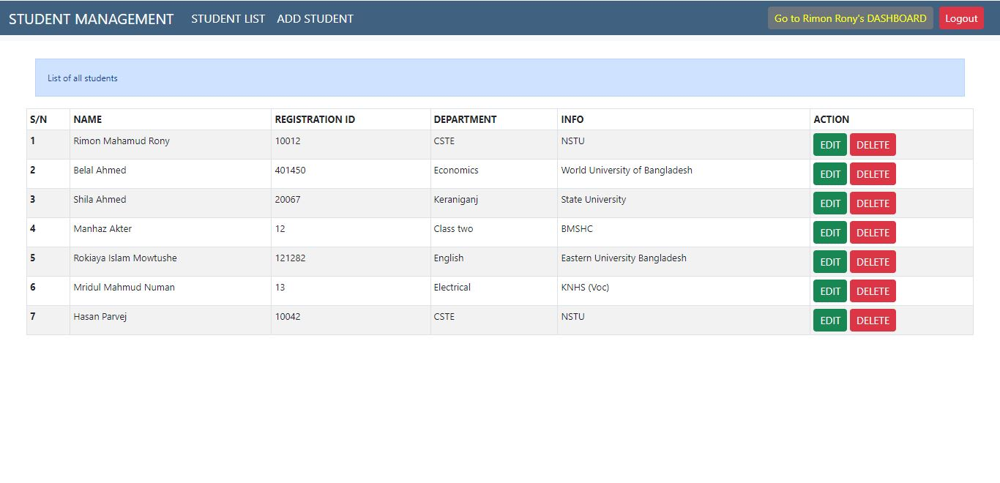
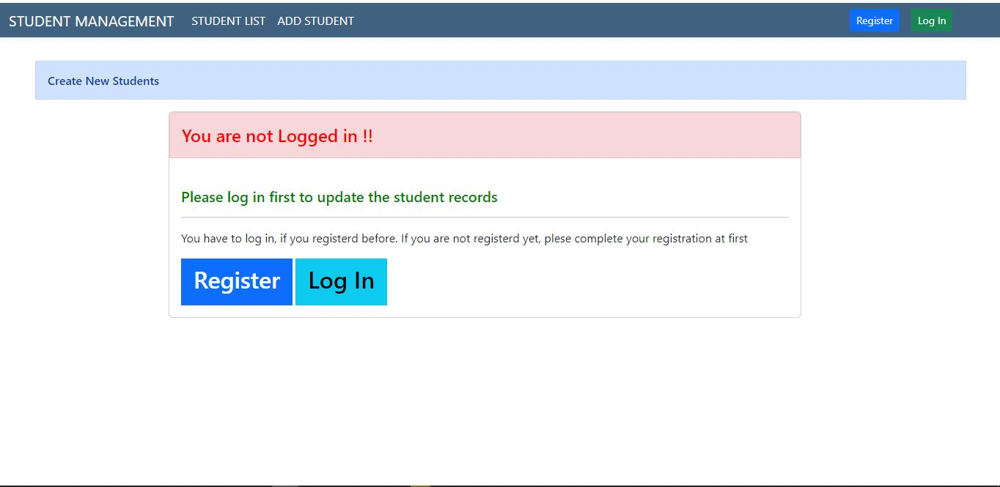
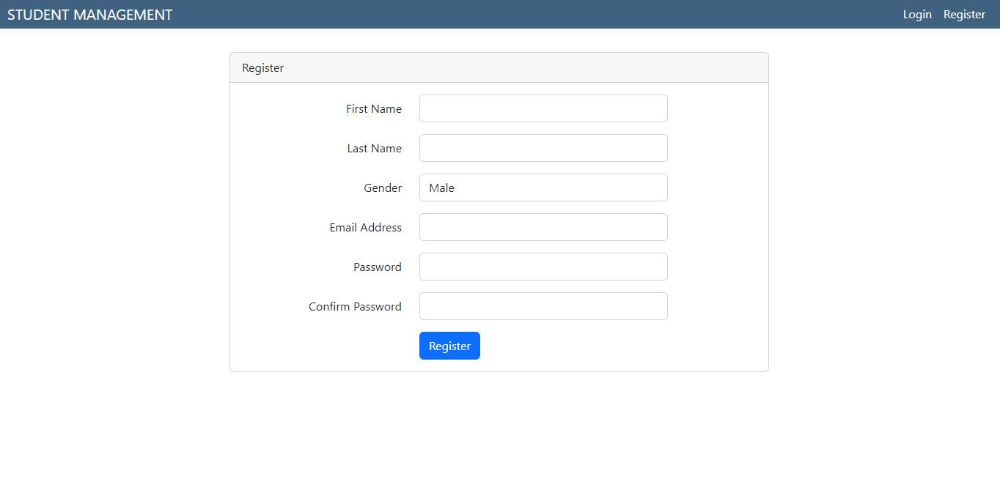

## About STUDENT MANAGEMENT

This is a professional student management system. Whre we full authentication system with form validation in both front-end and back end.

- Admin can register to the system and can find their own workpalce by using log in and logout.
- Admin can register new student, can update old student info, delete if any student records need to be deleted.
- Thres's have a very good authentication system.
- Guest users only can see the total student list.

## Technology Used

<ul>
    <li>Back-end: Php and Laravel.</li>
    <li>Front-end: JS, Bootstrap</li>
    <li>Database: RDBMS as phpmyadmin and MySQL.</li>
</ul>

## Validation

For front-end validation in the section of add new student or create new student I have used "Parsley" (JavaScript form validation library) and also "Laravel" built in validation methods.

For back-end validation I have used the Laravel validation technologies
 
